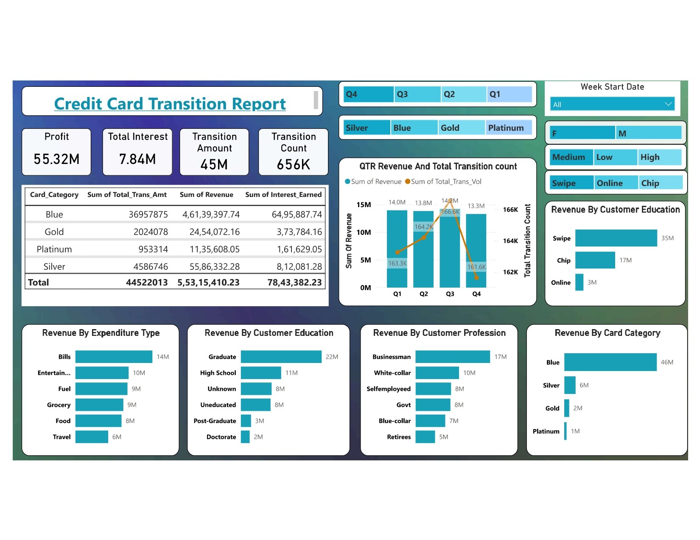
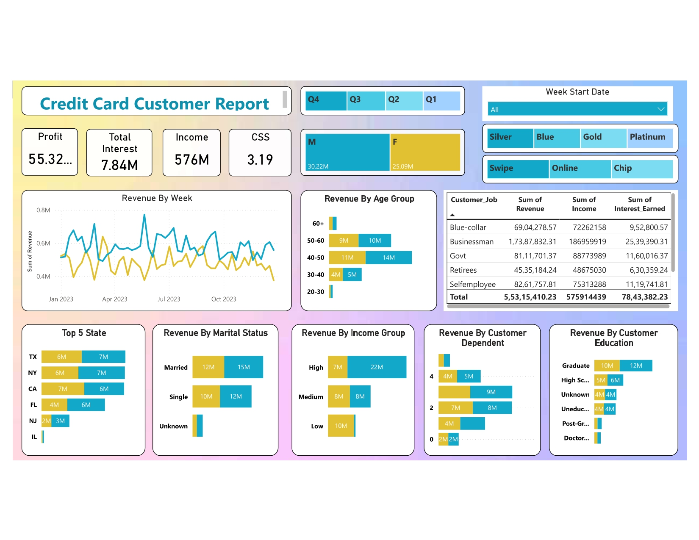

# Credit Card Financial Dashboard Using Power BI

## Project Overview

Welcome to the Credit Card Financial Dashboard project, an interactive Power BI dashboard designed to provide real-time insights into credit card transactions and customer data. This project consists of two main dashboards:

1. **Customer Credit Card Transaction Report**

2. **Credit Card Customer Report**

## Project Objective

The objective of this project is to develop a comprehensive weekly dashboard that provides real-time insights into key performance metrics and trends. This enables stakeholders to monitor and analyze credit card operations effectively.

## Key Features

- **Interactive Dashboard:** Developed using transaction and customer data from a SQL database to provide real-time insights.
- **Streamlined Data Processing & Analysis:** Efficiently monitor key performance metrics and trends.
- **Actionable Insights:** Shared with stakeholders to support decision-making processes based on dashboard findings.

## Project Insights - Week 53 (31st Dec)

### Week-over-Week (WoW) Change:
- **Revenue:** Increased by 28.8%
- **Total Transaction Amount & Count:** Increased by xx% & xx%
- **Customer Count:** Increased by xx%

### Year-to-Date (YTD) Overview:
- **Overall Revenue:** $57M
- **Total Interest:** $8M
- **Total Transaction Amount:** $46M
- **Revenue Contribution by Gender:**
  - Male: $31M
  - Female: $26M
- **Credit Card Types Contribution:**
  - Blue & Silver: 93% of overall transactions
- **Top Contributing States:**
  - TX, NY, CA: 68% of overall contributions
- **Overall Activation Rate:** 57.5%
- **Overall Delinquent Rate:** 6.06%

## Usage

To use this dashboard, follow these steps:

1. **Access the Dashboard:** Open the Power BI file containing the Credit Card Financial Dashboard.
2. **Interact with the Data:** Utilize the interactive features to filter and drill down into specific data points.
3. **Analyze Insights:** Review the key performance metrics and trends to gain insights into credit card operations.
4. **Share Findings:** Communicate actionable insights with stakeholders to support data-driven decision-making processes.

## Conclusion

This Power BI project provides a comprehensive view of credit card financial data, enabling stakeholders to monitor, analyze, and make informed decisions based on real-time insights. The dashboard offers a user-friendly interface with powerful data visualization capabilities to enhance understanding and drive business success.
